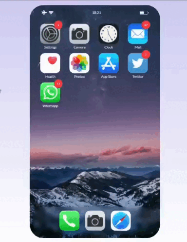

# Sortable-Draggable-Grid-without-libraries
This simple code lets you sort elements on the grid while dragging



See the complete code in codesandbox: https://codesandbox.io/s/iphone-group-apps-animation-txwkwl

# An overview of how it works

This is a script that handles the drag and drop functionality for a mobile app grid. The grid is created with a function createGrid() which takes an array of elements as input and positions them in a grid layout. The function sets the top, left, width, and height styles of each element based on its position in the grid.

```javascript 
function createGrid(data = elements, columns = 4, elementSize = 64, gap = 20) {
  data.forEach((item, i) => {
    const pos = {
      x: i % columns,
      y: Math.floor(i / columns)
    };
    item.dataset.index = i;
    item.style.top = `${pos.y * (elementSize + gap)}px`;
    item.style.left = `${pos.x * (elementSize + gap)}px`;
    item.style.width = `calc(${100 / columns}% - ${gap}px)`;
    item.style.height = `calc(${elementSize}px - ${gap / 10}px)`;
    item.style.boxSizing = "border-box";
  });
}
```

The script then adds an event listener for touchstart and mousedown events to each element in the grid. When an element is clicked or touched, the function ondragstart() is called. This function sets up the state for dragging the element by setting the target variable to the element that was clicked or touched, and adds event listeners for touchmove, mousemove, touchend, and mouseup events to the window object. It also sets the dragging variable to true.

When the user moves the mouse or finger while dragging, the function onDrag() is called. This function updates the position of the target element by setting its top and left styles based on the current mouse or finger position. It also calls the cursorStyle() function to change the cursor to a grabbing hand.

When the user stops dragging, the function onDragEnd() is called. This function removes the event listeners for touchmove, mousemove, touchend, and mouseup events from the window object, sets the target variable to null, and sets the dragging variable to false. It also calls the resetTarget() function to reset the target variable.

# How to get the element being overlaid and clicked

The code has a utility function named hitTest which is used to get the element that's being hovered by the cursor.

The hitTest function receives the current mouseX and mouseY coordinates of the cursor. It then calls the document.elementFromPoint method, which returns the topmost element at the specified coordinates.

If the returned element is not null and has a valid dataset.index attribute, the function will return an object containing the element and its index as { node: element, index: parseInt(element.dataset.index, 10) }. Otherwise, it will return null.

This function is used in the ondragstart and onDrag event listeners to check if the cursor is over a valid draggable element. If the cursor is over a valid element, the hitTest function will return an object containing the element and its index. If the cursor is not over a valid element, the hitTest function will return null.

```javascript
function hitTest(mouseX, mouseY) {
  const element = document.elementFromPoint(mouseX, mouseY);
  
  /* 
    it will work only if the element has no children otherwise use this code
    const elementClicked = document.elementFromPoint(mouseX, mouseY);
    const element = elementClicked.closest(".a_class_name");
  */
  
  

  try {
    if (!element !== null && !element.dataset.index) return null;
    // is a valid element
    return {
      node: element,
      index: parseInt(element.dataset.index, 10)
    };
  } catch (error) {
    return null;
  }
}

```
